# Online farmacy software

## v1.2

| Objects to operate on: | Actions to do on the objects:|
| --- | ---|
| 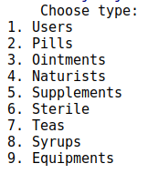|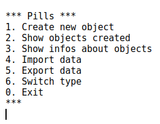 |

###### Samples of actions done

| 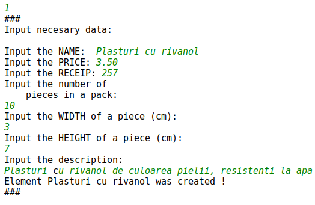  |  |
| ---   |---
| 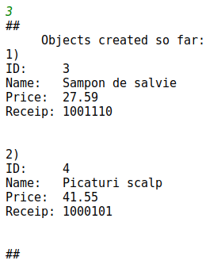           |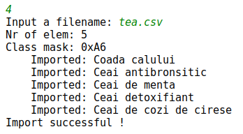

## v1.1
###### Objects to operate on:

|  | 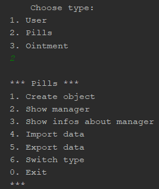 | 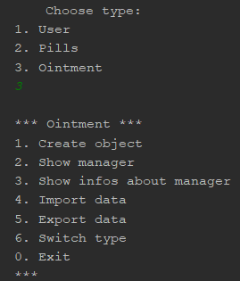 | 
|--- |---|---|

###### Actions to do:

<table>

| 1. Create new object | 2. Show objects created | 3. Show infos about objects | 4. Import data | 5. Export data |
| --- | --- | --- | --- | --- |
|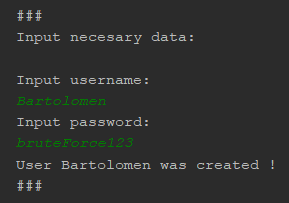 | 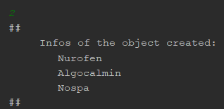 | 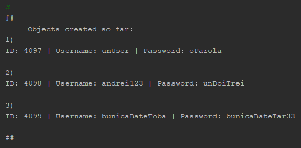 | 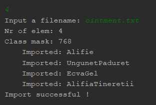 | 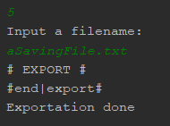 | 